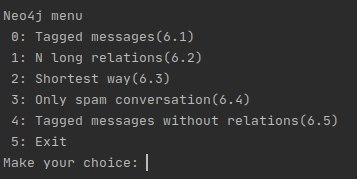
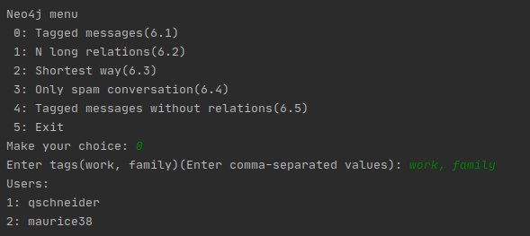
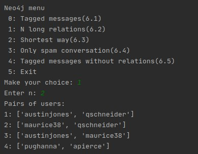
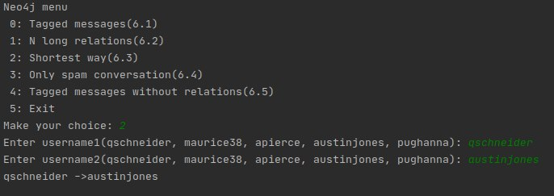
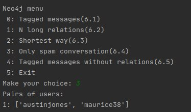
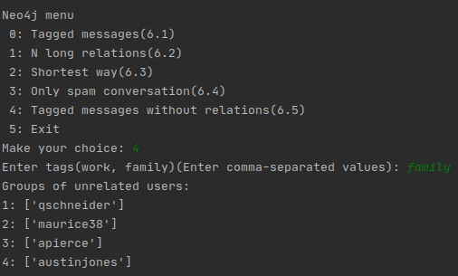

Лістинг коду
-----------------------------------
```
main.py
```

```python
def emulation():

    fake = Faker()
    users_count = 5
    users = [fake.profile(fields=['username'], sex=None)['username'] for u in range(users_count)]
    threads = []
    try:

        for i in range(users_count):
            threads.append(EmulationController(users[i], users, users_count, random.randint(1, 2)))
        for thread in threads:
            thread.start()

    except Exception as e:
        View.show_error(str(e))
    finally:
        for thread in threads:
            if thread.is_alive():
                thread.stop()


if __name__ == "__main__":
    choice = Controller.make_choice(["Neo4j", "Emulation(use one time with worker for generate db)"], "Program mode")
    if choice == 0:
        Neo4jController()
    elif choice == 1:
        emulation()
```


```
Neo4jServer.py
```

```python
class Neo4jServer(object):
    def __init__(self):
        self.__driver = GraphDatabase.driver("bolt://localhost:7687", auth=("neo4j", "123"))
        # self.__truncate_db()

    def close(self):
        self.__driver.close()

    def __truncate_db(self):
        with self.__driver.session() as session:
            session.run("MATCH (n) DETACH DELETE n")

    def registration(self, username, redis_id):
        with self.__driver.session() as session:
            session.run("MERGE (u:user {name: $username, redis_id: $redis_id})"
                        "ON CREATE SET u.online = false", username=username, redis_id=redis_id)

    def sign_in(self, redis_id):
        with self.__driver.session() as session:
            session.run("MATCH (u:user {redis_id: $redis_id}) SET u.online = true", redis_id=redis_id)

    def sign_out(self, redis_id):
        with self.__driver.session() as session:
            session.run("MATCH (u:user {redis_id: $redis_id}) SET u.online = false", redis_id=redis_id)

    def create_message(self, sender_id, consumer_id, message: dict):
        with self.__driver.session() as session:
            try:
                # session.write_transaction(self.__create_message_as_node, message["id"], message["tags"])
                messages_id = session.write_transaction(self.__create_message_as_relation, int(sender_id),
                                                        int(consumer_id), message["id"])
                for tag in message["tags"]:
                    session.write_transaction(self.__add_tag_to_messages, messages_id, tag)
            except Exception as e:
                View.show_error(str(e))

    @staticmethod
    def __create_message_as_relation(tx, sender_id, consumer_id, message_id):
        result = tx.run("MATCH(a: user {redis_id: $sender_id}), (b:user {redis_id: $consumer_id})"
                        "MERGE(a) - [r: messages]->(b)"
                        "ON CREATE SET r.all = [$message_id], r.spam = [], r.tags = []"
                        "ON MATCH SET r.all = r.all + $message_id "
                        "RETURN id(r)",
                        sender_id=sender_id, consumer_id=consumer_id, message_id=message_id)
        return result.single()[0]

    @staticmethod
    def __add_tag_to_messages(tx, messages_id, tag):
        tx.run("MATCH ()-[r]-() where ID(r) = $messages_id "
               "FOREACH(x in CASE WHEN $tag in r.tags THEN [] ELSE [1] END | "
               "SET r.tags = coalesce(r.tags,[]) + $tag)", messages_id=messages_id, tag=tag)

    def deliver_message(self, redis_id):
        with self.__driver.session() as session:
            session.run("MATCH (m:messages {redis_id: $redis_id }) SET m.delivered = true", redis_id=redis_id)

    def mark_message_as_spam(self, redis_id):
        with self.__driver.session() as session:
            session.run("MATCH (u1:user)-[r:messages]->(u2:user) "
                        "WHERE $redis_id IN r.all AND NOT $redis_id IN r.spam "
                        "SET r.spam = r.spam + $redis_id", redis_id=redis_id)

    def get_users_with_tagged_messages(self, tags):
        return self.__record_to_list(self.__get_users_with_tagged_messages_from_db(tags), 'name')

    def get_unrelated_users_with_tagged_messages(self, tags):
        list_of_names = self.__record_to_list(self.__get_users_with_tagged_messages_from_db(tags), 'name')
        unrelated_users = []
        for name1 in list_of_names:
            group = [name1]
            for name2 in list_of_names:
                if name1 != name2:
                    res = self.__check_relation_between_users(name1, name2)
                    if not res and name1 not in group:
                        group.append(name2)
            unrelated_users.append(group)

        return unrelated_users

    def __get_users_with_tagged_messages_from_db(self, tags):
        with self.__driver.session() as session:
            tags = tags.split(", ")
            for tag in tags:
                if not Tags.has_member(tag):
                    raise ValueError(f"Tag: {tag} doesnt exist")

            query = "MATCH (u:user)-[r:messages]-() WHERE"
            for tag in tags:
                query += f" \'{tag}\' IN r.tags AND"

            # removing last AND
            query = query[:-3] + "RETURN u"
            return session.run(query)

    def __check_relation_between_users(self, username1, username2):
        with self.__driver.session() as session:
            res = session.run("MATCH  (u1:user {name: $username1}), (u2:user {name: $username2}) "
                              "RETURN EXISTS((u1)-[:messages]-(u2))", username1=username1, username2=username2)
            return res.single()[0]

    def shortest_way_between_users(self, username1, username2):
        users = self.get_users()
        if username1 not in users or username2 not in users:
            raise ValueError('Invalid users names')
        with self.__driver.session() as session:
            shortest_path = session.run("MATCH p = shortestPath((u1:user)-[*..10]-(u2:user)) "
                                        "WHERE u1.name = $username1 AND u2.name = $username2 "
                                        "RETURN p", username1=username1, username2=username2)
            if shortest_path.peek() is None:
                raise Exception(f"Way between {username1} and {username2} doesnt exist")
            for record in shortest_path:
                nodes = record[0].nodes
                path = []
                for node in nodes:
                    path.append(node._properties['name'])
                return path

    def get_users_with_n_long_relations(self, n):
        with self.__driver.session() as session:
            res = session.run(f"MATCH p = (u1:user)-[*]-(u2:user)"
                              f"WHERE u1 <> u2 AND "
                              f"reduce(total_len = 0, r IN relationships(p)| total_len + size(r.all)) = {n} "
                              f"RETURN u1, u2")
            return self.__pair_record_to_list(res, 'name')

    def get_users_wicth_have_only_spam_conversation(self):
        with self.__driver.session() as session:
            res = session.run("MATCH p = (u1:user)-[]-(u2:user)"
                              "WHERE u1 <> u2 AND all(x in relationships(p) WHERE x.all = x.spam)"
                              "RETURN u1, u2")
            return self.__pair_record_to_list(res, 'name')

    def __pair_record_to_list(self, res, pull_out_value):
        my_list = list(res)
        my_list = list(dict.fromkeys(my_list))
        new_list = []
        for el in my_list:
            list_el = list(el)
            if list_el not in new_list and list_el[::-1] not in new_list:
                new_list.append(el)

        return [[el[0]._properties[pull_out_value], el[1]._properties[pull_out_value]] for el in new_list]

    def get_users(self):
        with self.__driver.session() as session:
            res = session.run("MATCH (u:user) RETURN u")
            return self.__record_to_list(res, 'name')

    def __record_to_list(self, res, pull_out_value):
        my_list = list(res)
        my_list = list(dict.fromkeys(my_list))
        return [el[0]._properties[pull_out_value] for el in my_list]

```

```
Neo4jController.py
```

```python
from controller.Controller import Controller
from servers.neo4j_server.Neo4jServer import Neo4jServer
from view import View


class Neo4jController(object):
    def __init__(self):
        self.__server = Neo4jServer()
        self.__menu = 'Neo4j menu'
        self.loop = True
        self.start()

    def start(self):
        from data import menu_list
        try:
            while self.loop:
                choice = Controller.make_choice(menu_list[self.__menu].keys(), self.__menu)
                Controller.considering_choice(self, choice, list(menu_list[self.__menu].values()))
        except Exception as e:
            View.show_error(str(e))

    def get_users_with_tagged_messages(self):
        res = self.__server.get_users_with_tagged_messages(*Controller.get_func_arguments(
            self.__server.get_users_with_tagged_messages))
        View.print_list("Users: ", res)

    def shortest_way_between_users(self):
        res = self.__server.shortest_way_between_users(*Controller.get_func_arguments(
            self.__server.shortest_way_between_users))
        View.show_way(res)

    def get_users_with_n_long_relations(self):
        res = self.__server.get_users_with_n_long_relations(*Controller.get_func_arguments(
            self.__server.get_users_with_n_long_relations))
        View.print_list("Pairs of users: ", res)

    def get_users_wicth_have_only_spam_conversation(self):
        res = self.__server.get_users_wicth_have_only_spam_conversation()
        View.print_list("Pairs of users: ", res)

    def get_unrelated_users_with_tagged_messages(self):
        res = self.__server.get_unrelated_users_with_tagged_messages(*Controller.get_func_arguments(
            self.__server.get_unrelated_users_with_tagged_messages))
        View.print_list("Groups of unrelated users: ", res)


```

```
data.py
```

```python

menu_list = {
    'Neo4j menu': {
        'Tagged messages(6.1)': Neo4jController.get_users_with_tagged_messages,
        'N long relations(6.2)': Neo4jController.get_users_with_n_long_relations,
        'Shortest way(6.3)': Neo4jController.shortest_way_between_users,
        'Only spam conversation(6.4)': Neo4jController.get_users_wicth_have_only_spam_conversation,
        'Tagged messages without relations(6.5)': Neo4jController.get_unrelated_users_with_tagged_messages,
        'Exit': Controller.stop_loop,
    }
}

roles = {
    'utilizer': 'Utilizer menu',
    'admin': 'Admin menu'
}

neo4j = Neo4jServer()
special_parameters = {
    'role': '(admin or utilizer)',
    'tags': '('+', '.join(x.name for x in list(Tags))+')(Enter comma-separated values)',
    'username1': '(' + ', '.join(x for x in neo4j.get_users()) + ')',
    'username2': '(' + ', '.join(x for x in neo4j.get_users()) + ')'
}
```

Постановка завдання
-----------------------------------
Приклади роботи програми
-----------------------------------
Main menu
-----------------------------------

-----------------------------------
Neo4j menu
-----------------------------------

-----------------------------------
Пункт 6.1
-----------------------------------

-----------------------------------
Пункт 6.2
-----------------------------------

-----------------------------------
Пункт 6.3
-----------------------------------

-----------------------------------
Пункт 6.4
-----------------------------------

-----------------------------------
Пункт 6.5
-----------------------------------


